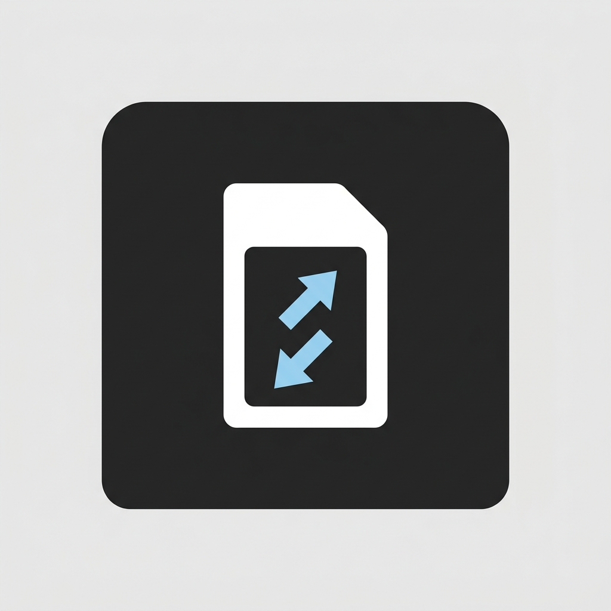

# Mobile Data Switcher

A sleek, ultra-fast, native Android application designed to seamlessly toggle mobile data between Dual SIM cards using a single-tap Quick Settings Tile.

<p align="center">
  
</p>

## ⚠️ The Problem Statement

If you use a Dual SIM Android phone, you already know the pain of switching active mobile data when your primary network drops. Finding yourself with a failing signal requires an incredibly tedious, multi-step chore: pulling down the notification shade, tapping into Internet settings, opening Network & Internet menus, navigating to SIM settings, selecting the secondary SIM card, and *finally* clicking the designated "Mobile Data" toggle switch.

To make matters worse, starting from modern Android iterations (Android 14+), Google locked down the underlying `SubscriptionManager` API. It is no longer possible for standard applications (or automation tools like Tasker) to programmatically toggle mobile data to save you from this menu-hopping nightmare without requiring system signatures or full device root access. This entirely crippled legacy 1-tap "data switcher" widgets.

## 💡 The Solution

Mobile Data Switcher solves this by bridging via [Shizuku](https://shizuku.rikka.app/). 

By securely utilizing Shizuku's ADB-based elevated privileges, the application bypasses strict OEM constraints. It executes privileged shell commands (`svc data enable`) natively, executing instantaneous mobile data handoffs completely within the background. No root required. No settings menus.

## ✨ Features

- **1-Tap Quick Settings Tile**: Drop it into your notification shade and instantly switch active data networks smoothly.
- **Deep Integration**: The custom Quick Settings Tile polls the background state and specifically surfaces your carrier's SIM Name and Phone Number directly inside the Tile Subtitle.
- **Root-less Power**: 100% relies on ADB Shell privileges over Shizuku, meaning you keep banking app compatibility and avoid unlocking bootloaders.
- **Premium UI**: Uses Jetpack Compose to deliver a meticulously clean, true-dark-mode aesthetic.

## 🛠 Instructions to Build

### Prerequisites
* [Android Studio (Jellyfish or newer)](https://developer.android.com/studio)
* Java JDK 17+
* [Shizuku Manager](https://shizuku.rikka.app/download/) installed on your Android device (Android 14+ compatible).

### Building the Project
1. **Clone the repository:**
   ```bash
   git clone https://github.com/adhupraba/mobile-data-switcher.git
   cd mobile-data-switcher
   ```

2. **Sync the project** either by launching Android Studio and letting Gradle resolve the dependencies natively or through the CLI:
   ```bash
   ./gradlew build
   ```

3. **Generate a Debug APK:**
   ```bash
   ./gradlew assembleDebug
   ```
   *The built APK will be located inside: `app/build/outputs/apk/debug/app-debug.apk`*

4. **Run Unit Tests (Optional but recommended):**
   ```bash
   ./gradlew testDebugUnitTest
   ```

### Installation & Setup Guide
1. Launch Android Studio, plug in your phone via USB, and hit **Run**.
2. **Start Shizuku**: Open the Shizuku app on your phone. If you are on Android 14+, use the **Start via Wireless Debugging** or **Start via ADB** method.
3. Open **Mobile Data Switcher**, tap any prominent SIM list tile, and carefully grant the **Shizuku Authorization Prompt**. 
4. Allow the **Phone Data (Read Phone State)** permission so the app can detect your network configuration.
5. Edit your System Quick Settings panel, drag and drop the "Switch Data" tile to the top, and enjoy!

## 📜 License

This project is open-sourced under the MIT License. See [LICENSE](LICENSE) for more details.
